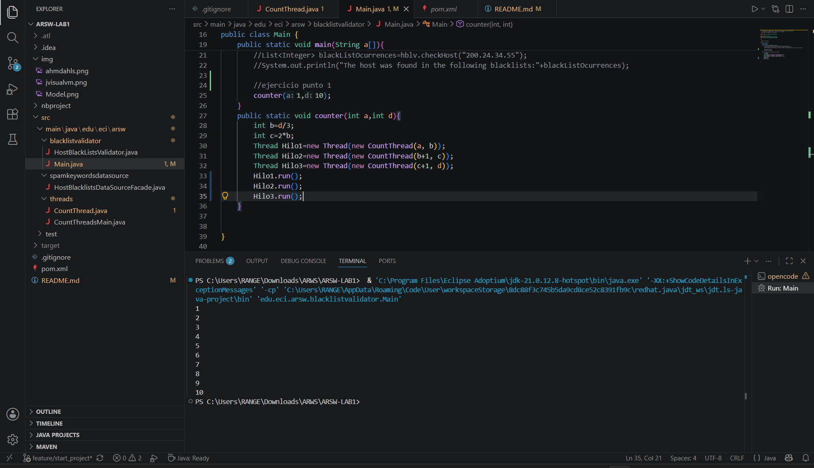
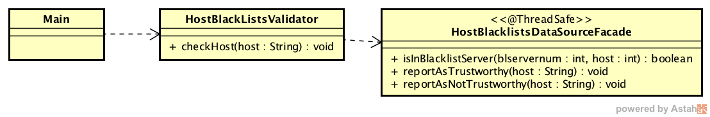
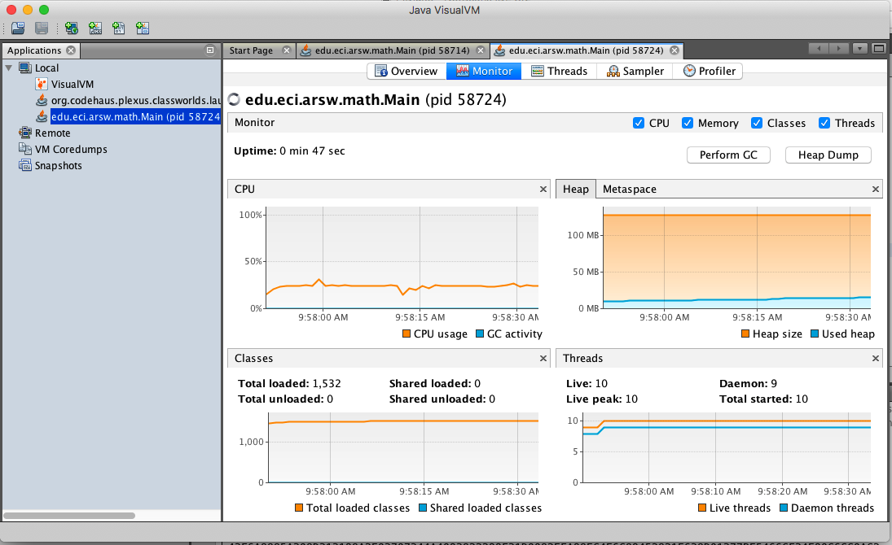
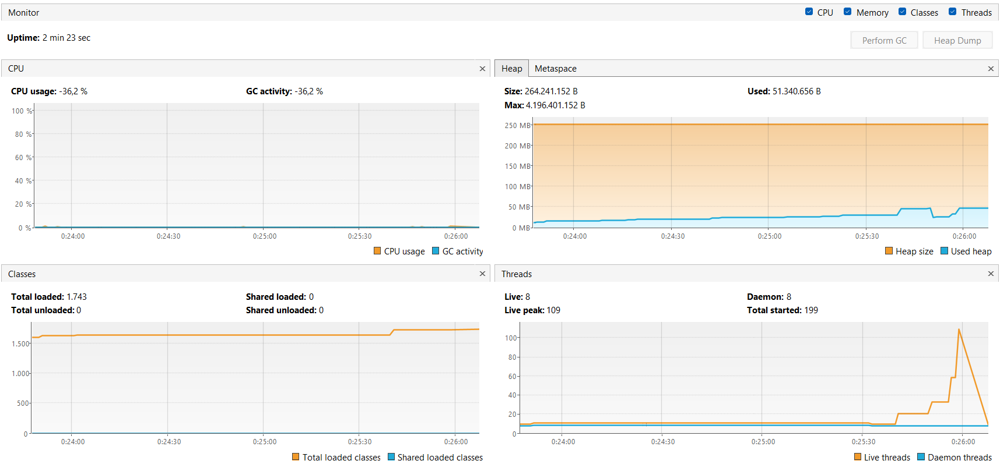
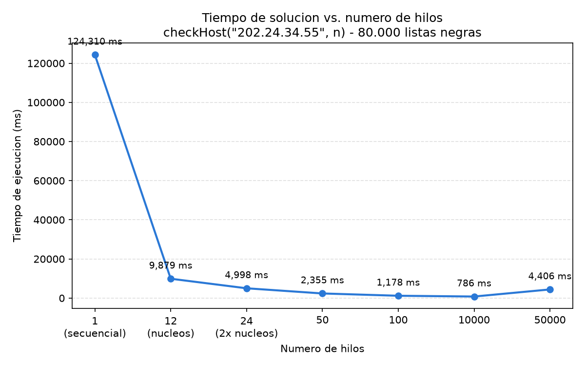

### Escuela Colombiana de Ingeniería
### Arquitecturas de Software - ARSW
## Ejercicio Introducción al paralelismo - Hilos - Caso BlackListSearch


### Dependencias:
####   Lecturas:
*  [Threads in Java](http://beginnersbook.com/2013/03/java-threads/)  (Hasta 'Ending Threads')
*  [Threads vs Processes]( http://cs-fundamentals.com/tech-interview/java/differences-between-thread-and-process-in-java.php)

### Descripción
  Este ejercicio contiene una introducción a la programación con hilos en Java, además de la aplicación a un caso concreto.
  

**Parte I - Introducción a Hilos en Java**

1. De acuerdo con lo revisado en las lecturas, complete las clases CountThread, para que las mismas definan el ciclo de vida de un hilo que imprima por pantalla los números entre A y B.
2. Complete el método __main__ de la clase CountMainThreads para que:
	1. Cree 3 hilos de tipo CountThread, asignándole al primero el intervalo [0..99], al segundo [99..199], y al tercero [200..299].
	2. Inicie los tres hilos con 'start()'.
	3. Ejecute y revise la salida por pantalla. 
	Se observa que los hilos escriben los numeros en desorden, debido a que se ejecutan en paralelo y el primero en imprimir puede ser cualquiera de ellos.
	4. Cambie el incio con 'start()' por 'run()'. Cómo cambia la salida?, por qué?.
		
	cambia porque no se crean hilos, el hilo principal es el que ejecuta los metodos paso por paso y no en paralelo 
**Parte II - Ejercicio Black List Search**


Para un software de vigilancia automática de seguridad informática se está desarrollando un componente encargado de validar las direcciones IP en varios miles de listas negras (de host maliciosos) conocidas, y reportar aquellas que existan en al menos cinco de dichas listas. 

Dicho componente está diseñado de acuerdo con el siguiente diagrama, donde:

- HostBlackListsDataSourceFacade es una clase que ofrece una 'fachada' para realizar consultas en cualquiera de las N listas negras registradas (método 'isInBlacklistServer'), y que permite también hacer un reporte a una base de datos local de cuando una dirección IP se considera peligrosa. Esta clase NO ES MODIFICABLE, pero se sabe que es 'Thread-Safe'.

- HostBlackListsValidator es una clase que ofrece el método 'checkHost', el cual, a través de la clase 'HostBlackListDataSourceFacade', valida en cada una de las listas negras un host determinado. En dicho método está considerada la política de que al encontrarse un HOST en al menos cinco listas negras, el mismo será registrado como 'no confiable', o como 'confiable' en caso contrario. Adicionalmente, retornará la lista de los números de las 'listas negras' en donde se encontró registrado el HOST.



Al usarse el módulo, la evidencia de que se hizo el registro como 'confiable' o 'no confiable' se dá por lo mensajes de LOGs:

INFO: HOST 205.24.34.55 Reported as trustworthy

INFO: HOST 205.24.34.55 Reported as NOT trustworthy


Al programa de prueba provisto (Main), le toma sólo algunos segundos análizar y reportar la dirección provista (200.24.34.55), ya que la misma está registrada más de cinco veces en los primeros servidores, por lo que no requiere recorrerlos todos. Sin embargo, hacer la búsqueda en casos donde NO hay reportes, o donde los mismos están dispersos en las miles de listas negras, toma bastante tiempo.

Éste, como cualquier método de búsqueda, puede verse como un problema [vergonzosamente paralelo](https://en.wikipedia.org/wiki/Embarrassingly_parallel), ya que no existen dependencias entre una partición del problema y otra.

Para 'refactorizar' este código, y hacer que explote la capacidad multi-núcleo de la CPU del equipo, realice lo siguiente:

1. Cree una clase de tipo Thread que represente el ciclo de vida de un hilo que haga la búsqueda de un segmento del conjunto de servidores disponibles. Agregue a dicha clase un método que permita 'preguntarle' a las instancias del mismo (los hilos) cuantas ocurrencias de servidores maliciosos ha encontrado o encontró.

Código implementado:

```
public class ThreadSearch extends Thread{
    private int inicio;
    private int fin;
    private String ip;

    private int ocurrencias;
    private int revisadas;
    private List<Integer> listas = new LinkedList<>();

    public ThreadSearch(int inicio, int fin, String ip){
        this.inicio = inicio;
        this.fin = fin;
        this.ip = ip;
    }

    @Override
    public void run(){
        HostBlacklistsDataSourceFacade skds = HostBlacklistsDataSourceFacade.getInstance();

        for (int i = inicio; i <= fin; i++){
            revisadas++;
            if (skds.isInBlackListServer(i, ip)){
                listas.add(i);
                ocurrencias++;
            }
        }
    }

    public int getOcurrencias(){
        return ocurrencias;
    }

    public int getRevisadas(){
        return revisadas;
    }

    public List<Integer> getListas(){
        return listas;
    }
}
```

Se hace uso de ```.join``` para que podamos imprimir el resultado de las ocurrencias luego de que termine la ejecución del Thread.


**Resultado del codigo:**


2. Agregue al método 'checkHost' un parámetro entero N, correspondiente al número de hilos entre los que se va a realizar la búsqueda (recuerde tener en cuenta si N es par o impar!). Modifique el código de este método para que divida el espacio de búsqueda entre las N partes indicadas, y paralelice la búsqueda a través de N hilos. Haga que dicha función espere hasta que los N hilos terminen de resolver su respectivo sub-problema, agregue las ocurrencias encontradas por cada hilo a la lista que retorna el método, y entonces calcule (sumando el total de ocurrencuas encontradas por cada hilo) si el número de ocurrencias es mayor o igual a _BLACK_LIST_ALARM_COUNT_. Si se da este caso, al final se DEBE reportar el host como confiable o no confiable, y mostrar el listado con los números de las listas negras respectivas. Para lograr este comportamiento de 'espera' revise el método [join](https://docs.oracle.com/javase/tutorial/essential/concurrency/join.html) del API de concurrencia de Java. Tenga también en cuenta:

	* Dentro del método checkHost Se debe mantener el LOG que informa, antes de retornar el resultado, el número de listas negras revisadas VS. el número de listas negras total (línea 60). Se debe garantizar que dicha información sea verídica bajo el nuevo esquema de procesamiento en paralelo planteado.

	* Se sabe que el HOST 202.24.34.55 está reportado en listas negras de una forma más dispersa, y que el host 212.24.24.55 NO está en ninguna lista negra.

Código implementado:

```
public List<Integer> checkHost(String ipaddress, int n){
        
    LinkedList<Integer> blackListOcurrences=new LinkedList<>();
    
    HostBlacklistsDataSourceFacade skds=HostBlacklistsDataSourceFacade.getInstance();

    int total = skds.getRegisteredServersCount();
    int residuo = total %n;
    int base = total /n;

    int inicio=0;

    ThreadSearch[] hilos = new ThreadSearch[n];

    for (int j = 0; j < n; j++) {
        int cantidad = base + (j< residuo ? 1 : 0);
        int fin = inicio + cantidad -1;

        hilos[j] = new ThreadSearch(inicio, fin, ipaddress);
        inicio += cantidad;
    }
    
    for(int i =0; i < n; i ++){
        hilos[i].start();
    }

    for(int i = 0; i < n; i++){
        try{
            hilos[i].join();
        } catch(InterruptedException e){
            LOG.log(Level.SEVERE, "Error en el hilo: " + e.getMessage(), e);
        }
    }

    int ocurrencesCount = 0;
    int checkedListsCount=0;
    for(int i =0; i < n; i ++){
        blackListOcurrences.addAll(hilos[i].getListas());
        ocurrencesCount += hilos[i].getOcurrencias();
        checkedListsCount += hilos[i].getRevisadas();
    }

    if (ocurrencesCount>=BLACK_LIST_ALARM_COUNT){
        skds.reportAsNotTrustworthy(ipaddress);
    }
    else{
        skds.reportAsTrustworthy(ipaddress);
    }

    LOG.log(Level.INFO, "Checked Black Lists:{0} of {1}",
            new Object[]{checkedListsCount, skds.getRegisteredServersCount()});

    return blackListOcurrences;
}
```

Se divide el espacio de búsqueda en N segmentos usando `base = total/n` y `residuo = total%n`, lo que permite manejar N par o impar sin dejar listas sin revisar ni revisar dos veces la misma. Cada hilo recorre un segmento, se espera con `join()` a que todos terminen, y se agregan las ocurrencias encontradas por cada hilo a la lista que retorna el método. El LOG final es verídico bajo el esquema paralelo porque la partición reparte cada lista negra a exactamente un hilo: la suma de las listas revisadas por los hilos es el total real de consultas realizadas.

**Resultado del codigo:**

```
INFO: HOST 200.24.34.55 Reported as NOT trustworthy
INFO: Checked Black Lists:80.000 of 80.000
The host was found in the following blacklists:[23, 50, 200, 500, 1000]
```


**Parte II.I Para discutir la próxima clase (NO para implementar aún)**

La estrategia de paralelismo antes implementada es ineficiente en ciertos casos, pues la búsqueda se sigue realizando aún cuando los N hilos (en su conjunto) ya hayan encontrado el número mínimo de ocurrencias requeridas para reportar al servidor como malicioso. Cómo se podría modificar la implementación para minimizar el número de consultas en estos casos?, qué elemento nuevo traería esto al problema?

**Parte III - Evaluación de Desempeño**

A partir de lo anterior, implemente la siguiente secuencia de experimentos para realizar las validación de direcciones IP dispersas (por ejemplo 202.24.34.55), tomando los tiempos de ejecución de los mismos (asegúrese de hacerlos en la misma máquina):


Obtuvimos el siguiente resultado:

1. Un solo hilo.

Hilos: 1, Tiempo: 124518 ms, Ocurrencias: 5

2. Tantos hilos como núcleos de procesamiento (haga que el programa determine esto haciendo uso del [API Runtime](https://docs.oracle.com/javase/7/docs/api/java/lang/Runtime.html)).


Hilos: 12, Tiempo: 10353 ms, Ocurrencias: 5

3. Tantos hilos como el doble de núcleos de procesamiento.

Hilos: 24, Tiempo: 5219 ms, Ocurrencias: 5


4. 50 hilos.

Hilos: 50, Tiempo: 2356 ms, Ocurrencias: 5

5. 100 hilos.

Hilos: 100, Tiempo: 1173 ms, Ocurrencias: 5

Al iniciar el programa ejecute el monitor jVisualVM, y a medida que corran las pruebas, revise y anote el consumo de CPU y de memoria en cada caso. 

El monitoreo del programa que emula los 5 puntos anteriores se muestra:



Con lo anterior, y con los tiempos de ejecución dados, haga una gráfica de tiempo de solución vs. número de hilos. Analice y plantee hipótesis con su compañero para las siguientes preguntas (puede tener en cuenta lo reportado por jVisualVM):




**Hipotesis:**

Existe un punto óptimo de hilos, no mientras más mejor

La curva tiene forma de U: mejora sin parar hasta 10.000 hilos (786 ms), pero en 50.000 vuelve a subir a 4.406 ms. Esto pasa porque el trabajo total es fijo (80.000 listas), así que entre más hilos se crean, menos le toca hacer a cada uno, y en algún punto crear y agendar el hilo cuesta más que el trabajo que ese hilo realmente hace. Ahí el overhead empieza a ganarle al paralelismo. Habría que probar con valores intermedios (15.000, 20.000, 30.000) para ubicar mejor ese punto óptimo.


**Parte IV - Ejercicio Black List Search**

1. Según la [ley de Amdahls](https://www.pugetsystems.com/labs/articles/Estimating-CPU-Performance-using-Amdahls-Law-619/#WhatisAmdahlsLaw?):

	, donde _S(n)_ es el mejoramiento teórico del desempeño, _P_ la fracción paralelizable del algoritmo, y _n_ el número de hilos, a mayor _n_, mayor debería ser dicha mejora. Por qué el mejor desempeño no se logra con los 500 hilos?, cómo se compara este desempeño cuando se usan 200?. 

El mejor desempeño no se logra con 500 hilos porque la ley de Amdahl asume un costo de coordinación nulo, pero en la práctica cada hilo adicional agrega overhead: creación y memoria (~1MB de pila por hilo), cambio de contexto cuando hay más hilos que núcleos, y contención sobre los recursos compartidos. Ese overhead crece con el número de hilos, por lo que el rendimiento tiene un punto óptimo y luego cae. Por eso 200 hilos rinden más que 500: se mantiene una sobre-suscripción suficiente para cubrir la latencia de las consultas, sin saturar al planificador. Más hilos no significan mejora cuando el tiempo que el sistema gasta en crear e intercambiar hilos supera al tiempo que los hilos ahorran al paralelizar el trabajo.


2. Cómo se comporta la solución usando tantos hilos de procesamiento como núcleos comparado con el resultado de usar el doble de éste?.

Respuesta corta: con el doble de hilos que núcleos se obtiene casi el doble de rendimiento cuando la carga es de latencia, porque el cuello de botella no es la CPU sino la espera de las respuestas.
Tu dato lo muestra perfecto:
- 16 hilos (núcleos): 7.678 ms
- 32 hilos (doble): 3.813 ms ← la mitad exacta

Las mediciones se realizaron sobre la implementación entregada en la Parte II, sin el corte temprano de la Parte II.I (que el enunciado indica solo para discusión). Por eso cada experimento recorre las 80.000 listas completas, y el LOG muestra siempre "Checked Black Lists:80.000 of 80.000".

También hay que tener en cuenta que si la tarea fuera CPU pura (cálculo matemático), el doble de hilos no mejoraría, porque los núcleos ya estarían saturados y solo sumaría contexto switching. Que al duplicar los hilos el tiempo baje a la mitad (de 7.678 ms a 3.813 ms) confirma que la carga es de latencia: los hilos pasan la mayor parte del tiempo esperando la respuesta de las consultas, no calculando.

3. De acuerdo con lo anterior, si para este problema en lugar de 100 hilos en una sola CPU se pudiera usar 1 hilo en cada una de 100 máquinas hipotéticas, la ley de Amdahls se aplicaría mejor?. Si en lugar de esto se usaran c hilos en 100/c máquinas distribuidas (siendo c es el número de núcleos de dichas máquinas), se mejoraría?. Explique su respuesta.

La ley de Amdahl se aplicaría mejor con 100 máquinas y 1 hilo cada una, siempre que los datos estén distribuidos (cada máquina consulta su propia copia de listas negras): desaparecen el context switching, la contención sobre el heap y el singleton compartido, y el límite de Amdahl se acerca al valor teórico S(100).

La opción de c hilos en 100/c máquinas mejora aún más, porque mantiene 100 hilos activos (cubriendo la latencia de las consultas) pero cada uno en un núcleo propio, sin sobre-suscripción ni intercambio de contexto — es el mismo grado de paralelismo, con el overhead de coordinación reducido al mínimo. La ley de Amdahl no cambia: lo que cambia es que el overhead real se achica hasta acercarse al modelo ideal que ella asume.


Nombres:
Hernan Sanchez,Juan David Rangel


